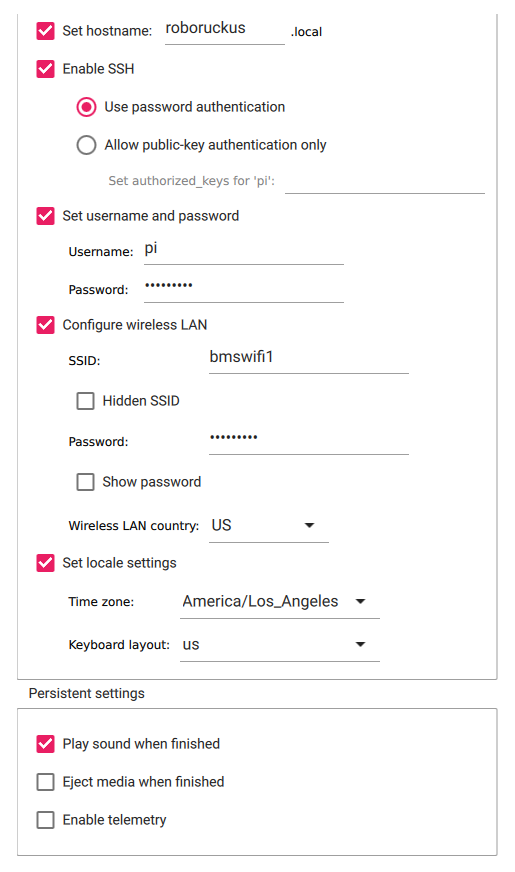

# RoboRuckus Bootstrap
Instructions for setting up the the RoboRuckus game and programming a Ring:bit Car robot for the first time.
## Requirements

### Software
- Visual Studio Code
	- w/ Platform.io extension
- [Raspberry Pi OS Lite 64-bit ISO Image](https://www.raspberrypi.com/software/operating-systems/#raspberry-Pi-os-64-bit)
- [Game Server Code](https://github.com/ShVerni/RoboRuckus/tree/master/PiReady)
- [Robot Code](https://github.com/tagnw/robotics/tree/main/projects/arduino_ruckus_mm/Mbits/Ringbit%20Car/Ringbit_Car_PlatformIO)
- 8GB+ MicroSD

### Physical Items

- Programming Laptop
- Charger for laptop
- Raspberry Pi
- MicroSD Card
- Power supply for Pi
- Tablets for game control
- Robots
	- Batteries or power supply
- MicroUSB cable for programming robots

## Getting Started

1. Download the large files needed
	1. Visual Studio Code
2. [Install the PlatformIO IDE extension for Visual Studio Code](https://docs.platformio.org/en/latest/integration/ide/vscode.html#installation)
	1. Open Visual Studio Code
	2. Either click on the extension icon (insert screenshot) or press `ctrl+shift+x` to open the extensions marketplace
	3. Search for "PlatformIO IDE"
	4. Click Install
3. [Install Raspberry Pi Imaging Utility](https://www.raspberrypi.com/software/)
	1. Download the file appropriate to your system
	2. Install the program
4. Image your MicroSD card
	1. Insert MicroSD card into computer
	2. Run "Imager"
	3. Select Operating System
		1. Other
		2. Raspberry Pi OS Lite (32-bit)
	4. Select MicroSD card as storage
	5. Click the gear and configure the settings, see screenshot[^1] 
	6. Click "Write"
5. [Setup freshly imaged sd card w/ headless mode](https://www.raspberrypi.com/documentation/computers/configuration.html#setting-up-a-headless-raspberry-pi)
	1. Copy PiReady/RoboRuckus from the game server code to /home/pi/RoboRuckus on the SD card (if on linux)
	2. If not on Linux, use SCP command to copy the folder, for example `scp -r PiReady/RoboRuckus pi@192.168.1.3:`
	3. Safely Eject
6. After booting and SSHing into the Pi
	1. [Configure files for execution](https://www.roboruckus.com/documentation/setting-up-the-game/#Setting-Up-RoboRuckus)
	2. [Run the game using the browser UI](https://www.roboruckus.com/documentation/running-a-game/)
7. From your laptop
	1. Open Visual Studio Code
	2. Open robot code folder: `robotics/projects/arduino_ruckus_mm/Mbits/Ringbit Car/Ringbit_Car_PlatformIO`
	3. Trust us >:)
	4. Click on the checkmark on the bottom blue bar "Build"
	5. Should exit successfully, if it doesn't...Message Sam.
8. Connect to the raspberry Pi via SSH
	1. `ssh pi@roboruckus.local` if mDNS is working, otherwise determine you Pi's IP address.
9. Connect to robot
	1. Plug in to laptop
	2. Open Visual Studio Code
	3. Upload using ringbit car project
	4. DO NOT UNPLUG OR RESET UNTIL DUCK SHOWS UP!!! This will take a few minutes on first flash since it needs to format the SPIFS
10. Connect to randomly generated SSID `Ruckus_<numbers>`
	1. Wifi password is `RuckusBot` by default
	2. Captive portal should show up (sign in)
	3. Click on Configure WiFi
		1. Connect to same wifi as Raspberry Pi
		2. Use same IP and port as the Pi (try `ping roboruckus.local` from laptop if unsure of IP)
11. Connect to game server
	1. http://roboruckus.local:8082/setup (or IP adress instead of roboruckus.local)
	2. [Tune robot(s)](https://www.roboruckus.com/documentation/running-a-game/#Tuning-the-Robots)
12. [Play!](https://www.roboruckus.com/documentation/running-a-game)
13. To update the robot's firmware:
	1. Connect to the same network as it and conenct its IP address anytime when it's showing a smiley face.
	2. Upload the `.pio/build/esp32dev/firmware.bin` file from Platform.io
	3. The update will take a while, wait until the robot shows a check-mark and reboots.
14. Gyroscope calibraton:
	1. During startup, the robot will calibrate the gyroscope, it's important not to move the robot during this process.
	2. Calibration can be manually performed by pressing the `A` button anytime after the robot has shown a smiley face.
15. To reset the robot's WiFi settings, hold the `A` button during power-up until a check-mark is shown, the robot will reboot and the captive portal should appear again.

[^1]: 
